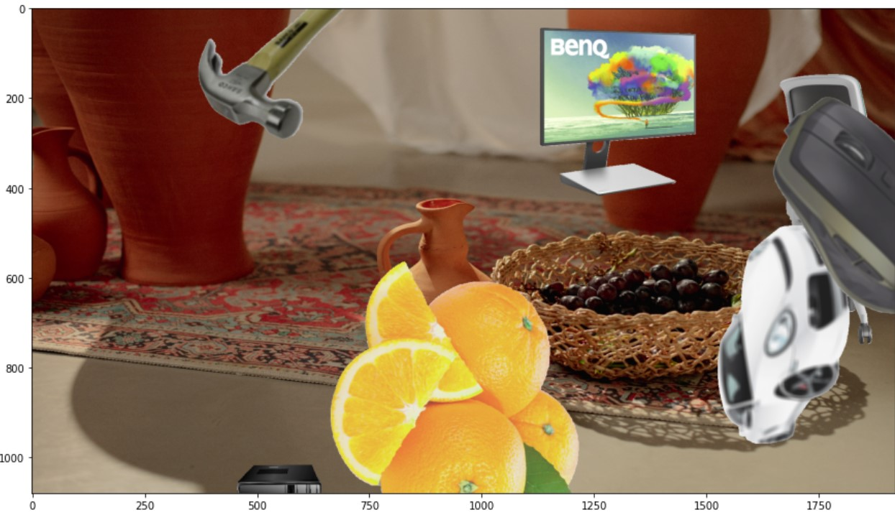
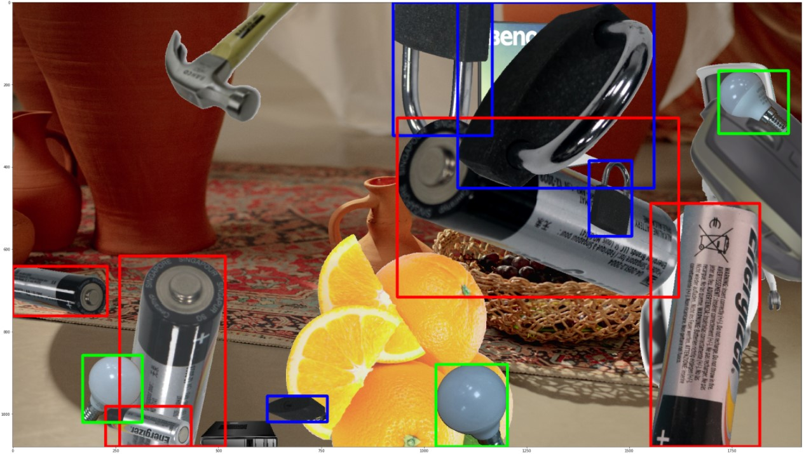

# Synthetic Dataset for Object Detection

## Introduction

This notebook is based on notebook of Alex P that can be found [here](https://github.com/alexppppp/synthetic-dataset-object-detection).

This project makes use of albumentatioos library to generate synthetic images. Albumentations is a fast and flexible image augmentation library project that can be found [here](https://github.com/albumentations-team/albumentations).

I've updated the notebook adding comments and the COCO format to the generated images.

In the figure below, the first image is the original image,

    

the second image is the augmented image and

    
      

 the third image is the augmented image with the bounding boxes.

    
      

In the function `generate_dataset4coco()` you can define the number of augmented images you want to generate and the target operation: `train, valid, test`. 
The generator will provide the json file with bounding boxes for each image as well.

Enjoy!
